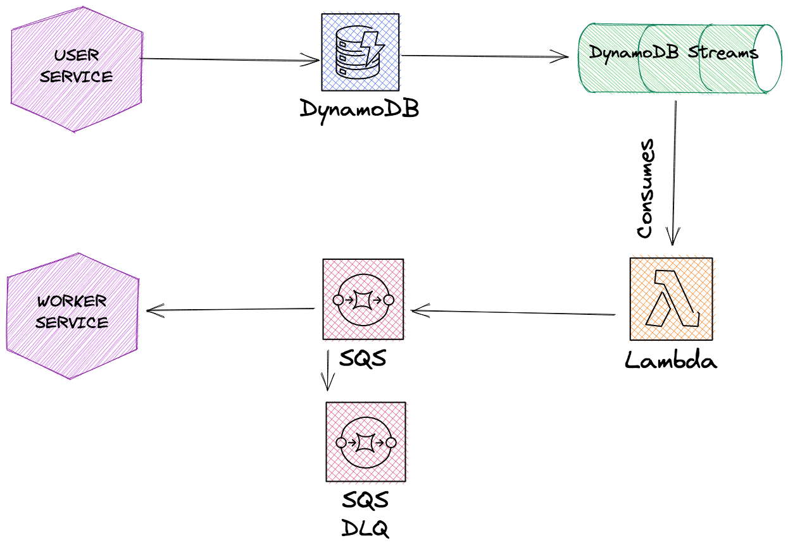

## Exemplo de projeto usando DynamoDB Streams (WIP)


Projeto para exemplificar o uso do [dynamodb streams](https://docs.aws.amazon.com/pt_br/amazondynamodb/latest/developerguide/Streams.html)


## Arquitetura





### Referências

https://engineering.zalando.com/posts/2022/02/transactional-outbox-with-aws-lambda-and-dynamodb.html
https://docs.aws.amazon.com/amazondynamodb/latest/developerguide/Streams.Lambda.Tutorial.html#Streams.Lambda.Tutorial.LambdaFunction


## Como executar

O projeto possui um `makefile` configurado, utilize os seguintes comandos:

Para subir toda a infraestrutura via docker
```sh
make up
```

Em seguida, suba a api em dotnet

```sh
dotnet run --project userprofile-api/Api
```

a api disponibiliza um endpoint para cadastrar um novo usuário, que pode ser invocado da seguinte maneira

```sh
curl -X 'POST' \
  'https://localhost:7242/api/User' \
  -H 'accept: text/plain' \
  -H 'Content-Type: application/json' \
  -d '{
  "username": "test-username",
  "email": "test@test.com"
}'
```
se você preferir a api também está com o swagger ui então a requisição poderá ser feita pela interface web no endereço `https://localhost:7242/swagger/index.html`

Ao realizar a requisição a api irá inserir o valor na tabela `Users` no dynamo. Esta tabela possui dynamodb-streams ativado e está realizando o trigger de uma lambda. A lamba por sua vez irá imprimir no console o evento que acabou de ser inserido no dynamo.

Para finalizar o docker e remover a infra
```sh
make down
```


## instruções para a lambda

É recomendável criar uma ambiente virtual para excução do código python, para isso execute os seguintes comandos:

```shell
cd lambda
pip3 install virtualenv #caso não tenha o virtual environment instalado
python3 -m venv .venv
source .venv/bin/activate
```

Para instalar as dependências use:

```shell
pip3 install -r requirements.txt
```
